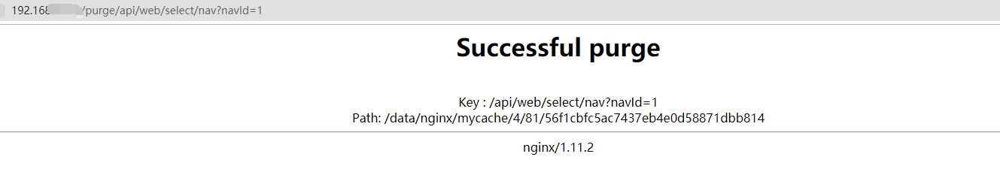
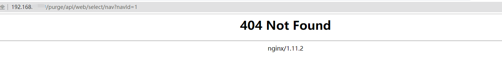

## nginx cache缓存

[TOC]

### 1、前言

说起缓存，大家也许知道CDN。购买CDN服务后，服务提供商会把你的资源都缓存到各个加速节点上，当用户访问时，会自动获取距离用户最近节点的缓存资源，直接由最近的节点快速响应，有效解决网站访问慢，延迟高等问题。

nginx缓存和CDN不同，nginx是缓存到当前机器上，减少同一资源的重复请求和服务器并发请求的压力，让网站响应访问更快。

`nginx主要采用proxy_cache_path指令，去定义共享的缓存`

### 2、配置缓存

> nginx.conf

~~~nginx
proxy_cache_path /data/nginx/mycache levels=1:2 keys_zone=mycache:100m max_size=1024m inactive=7d
# 缓存存放的位置是 /data/nginx/mycache，目录层级为两层，最多存放 1024M 缓存
# keys_zone=mycache:100m 缓存key存放的内存空间是 mycache ，单个缓存最大为100m
# inactive=7d 自动移除7d内没有人访问的缓存
~~~

> server配置

~~~nginx
server {
  listen 80;
  server_name localhost;

  location / {
    proxy_cache mycache;
    proxy_cache_valid 200 206 304 301 302 7d;
    proxy_cache_key $uri;
    proxy_set_header Host $host:$server_port;
    proxy_set_header X-Real-IP $remote_addr;
    proxy_set_header X-Forwarded-For $proxy_add_x_forwarded_for;
    # 缓存状态标记
    add_header Nginx-Cache "$upstream_cache_status";
    proxy_http_version 1.1;
    proxy_set_header Connection "";
    proxy_pass http://192.168.66.19:8090;
  }
}

# $upstream_cache_status包含以下几种状态：
#	MISS 未命中，请求被传送到后端
#	HIT 缓存命中
#	EXPIRED 缓存已经过期请求被传送到后端
#	UPDATING 正在更新缓存，将使用旧的应答
#	STALE 后端将得到过期的应答
~~~

> 查看缓存文件和响应头
>

~~~shell
[root@A /]# ll /data/nginx/mycache/
总用量 0
drwx------ 10 nobody nobody  86 1月  19 14:29 0
drwx------ 10 nobody nobody  86 1月  19 14:29 1
drwx------  8 nobody nobody  66 1月  19 14:29 2
drwx------  6 nobody nobody  46 1月  19 14:29 3
drwx------  9 nobody nobody  76 1月  19 14:29 4
drwx------  4 nobody nobody  26 1月  19 14:27 5
drwx------ 13 nobody nobody 116 1月  19 14:29 6
drwx------  5 nobody nobody  36 1月  19 14:29 7
drwx------  7 nobody nobody  56 1月  19 14:29 8
drwx------ 17 nobody nobody 156 1月  19 14:29 9
drwx------  6 nobody nobody  46 1月  19 14:29 a
drwx------ 11 nobody nobody  96 1月  19 14:29 b
drwx------  8 nobody nobody  66 1月  19 14:29 c
drwx------  7 nobody nobody  56 1月  19 14:29 d
drwx------  9 nobody nobody  76 1月  19 14:29 e
drwx------  6 nobody nobody  46 1月  19 14:29 f
~~~

~~~shell
Response Header:
HTTP/1.1 200 OK
Server: nginx/1.11.2
Date: Tue, 19 Jan 2021 06:29:39 GMT
Content-Type: image/jpeg
Content-Length: 344991
Connection: keep-alive
Last-Modified: Tue, 29 Dec 2020 06:45:35 GMT
ETag: "5fead08f-5439f"
# 响应头立马标明Hit是走了缓存
Nginx-Cache: HIT
Accept-Ranges: bytes
~~~

> 分析下缓存的文件

~~~shell
[root@ conf.d]# cd /data/nginx/mycache/
[root@ mycache]# ll
总用量 0
drwx------  5 nobody nobody  36 1月  19 17:15 0
drwx------  7 nobody nobody  56 1月  19 17:15 1
drwx------  9 nobody nobody  76 1月  19 17:15 2
drwx------  5 nobody nobody  36 1月  19 17:15 3
drwx------  4 nobody nobody  26 1月  19 17:15 4
drwx------  3 nobody nobody  16 1月  19 17:15 5
drwx------ 10 nobody nobody  86 1月  19 17:15 6
drwx------  4 nobody nobody  26 1月  19 17:15 7
drwx------  8 nobody nobody  66 1月  19 17:15 8
drwx------ 12 nobody nobody 106 1月  19 17:15 9
drwx------  7 nobody nobody  56 1月  19 17:15 a
drwx------  8 nobody nobody  66 1月  19 16:56 b
drwx------  7 nobody nobody  56 1月  19 16:56 c
drwx------  6 nobody nobody  46 1月  19 17:15 d
drwx------  3 nobody nobody  16 1月  19 16:56 e
drwx------  7 nobody nobody  56 1月  19 17:15 f
# 缓存文件的树形结构
[root@intranet-sso-uc mycache]# tree
.
├── 0
│   ├── 6c
│   │   └── 9ae9c2f571e0686404c33c7daeaa06c0
│   ├── 8a
│   │   └── 89fd0882a629e6219440dc2c2a1728a0
│   └── cb
│       └── 01f416e47e21f704999f91395b203cb0
├── 1
│   ├── 33
│   │   └── b2b723a43ffbcb52895de63af10c3331
│   ├── 48
│   │   └── 4c98030d1e7cde9952f12149800f5481
│   ├── 50
│   │   └── 63423e0931541247e600ce4b19498501
│   ├── 54
│   │   └── 0660d7e3fa893d9cada7645f347a8541
│   └── e4
│       └── fe321d64b34ada0fe8dc0653199d5e41
├── 2
│   ├── 12
│   │   └── 7ed64f947ec3d1372321f03ca626e122
│   ├── 27
│   │   └── 0c3b3a8aae4b25cadef128f0f1066272
│   ├── 5f
│   │   └── 7214874cd1b5f713fc36f58d356b85f2
│   ├── 9b
│   │   └── d4cf56855cb03dcd5c3c72d6cd63a9b2
│   ├── ae
│   │   └── 11cb7df570b1b301421d3bd8371d0ae2
│   ├── b2
│   │   └── cd92f4555f2c1ebd3c91281e58ef1b22
│   └── ce
│       └── a9b9d14cb18c3bdfffb43add07274ce2
├── 3
│   ├── 14
│   │   └── 12defce88137f1e7f8a45039a1475143
│   ├── 5e
│   │   └── a67e128c8c6248d2096679608ded85e3
│   └── 86
│       └── 485bbc7486cf36e34d3b366ff6cdc863
├── 4
│   ├── 9b
│   │   └── 3840ff95cc47e9f1f57335a8cfc549b4
│   └── a4
│       └── 1df942d653c6faf959703a733e764a44
├── 5
│   └── 7e
│       └── a514fa7e1ba5f3ee1d18b3119f8ed7e5
├── 6
│   ├── 01
│   │   └── f82f942af8321678a87dd9d3574b2016
│   ├── 02
│   │   └── 91d7283dc35d682bb48c550f0ba04026
│   ├── 13
│   │   └── eae7ee8ee076f44fa2e89e4be81d6136
│   ├── 91
│   │   └── 05ffa9f02ec224a1903ac67cbe18c916
│   ├── af
│   │   └── 8d36734e0889c6824a734695f1bc0af6
│   ├── d0
│   │   └── 1ed1eaa4c88b4b159f57111bd7ab5d06
│   ├── d8
│   │   └── 2663c0aba362e45d6fe8ff208b4e3d86
│   └── e6
│       └── c411c8b600995d375bd6847b39530e66
├── 7
│   ├── 7d
│   │   └── f1b7e28273b0cfa2e89017d19958f7d7
│   └── cb
│       └── 65746eca271882028ab6c3dd6515ccb7
├── 8
│   ├── 15
│   │   └── 781c040f32284af16eccb94348696158
│   ├── 26
│   │   └── c8a8b5be72449e52d2b9e967e5f77268
│   ├── 95
│   │   └── 49ea98efeb7ff338d0c7106448f12958
│   ├── 96
│   │   └── 413d6f4fbff770df85644c86acf7d968
│   ├── 9f
│   │   └── 7a1bef87f7ed095e5b1475a06dc909f8
│   └── fa
│       └── d53e83d6753a983786ac0d1990852fa8
├── 9
│   ├── 65
│   │   └── de54cb450c5df4076167ee4f72e5d659
│   ├── 7d
│   │   └── 6666cd76f96956469e7be39d750cc7d9
│   ├── 87
│   │   └── 86687aa6db0f9cef67c78ca0c9e05879
│   ├── 9a
│   │   └── b7a6417d24ed983a3cc8f0b99fcc19a9
│   ├── 9d
│   │   └── 35a63c8a85b1279a0f991ce8828fb9d9
│   ├── b9
│   │   └── ee6de8f5f99600772d32573d6ec18b99
│   ├── c2
│   │   └── fb7004eceb8226d8f96fba8db5d8bc29
│   ├── c7
│   │   └── f3c633c9af460f0eec5a15ab9729ec79
│   ├── ea
│   │   └── 767cb65c0b2c73b52728f1b477211ea9
│   └── fe
│       └── 495b4912b20cab0427e403c097e7ffe9
├── a
│   ├── 13
│   │   └── 17e274514ff3617ed7d5d79ab415813a
│   ├── 53
│   │   └── 123894b06cea028a5d9811215f3c053a
│   ├── c3
│   │   └── 93462aab0d354f3cb97ede5ed2d6fc3a
│   ├── e7
│   │   └── c4a16c5a6fd27939cb73d5320f197e7a
│   └── ed
│       └── 4e3fd92bad2ccb81bc2057b98605ceda
├── b
│   ├── 31
│   │   └── 5386768afecd87dda979f6d334ab331b
│   ├── 50
│   │   └── 10231799803326c557073800fe3bf50b
│   ├── 8c
│   │   └── 2b0b48516c4f8c930743f47ac69868cb
│   ├── d0
│   │   └── 3f8e127f3c7dd449187f14e803cc0d0b
│   ├── d3
│   │   └── 9a6d85fac597d4d094020be0887c3d3b
│   └── e2
│       └── c63d6dc1b9635f9b3c3f4b7e99060e2b
├── c
│   ├── 09
│   │   └── 98d57d14791e9ff9cc78e6128cbc109c
│   ├── 1a
│   │   └── 0f9dc5b1ea56e9d53421a2c46ba791ac
│   ├── 33
│   │   └── d41e7f6e551d5a90ecfab6c5c3e9433c
│   ├── 89
│   │   ├── 0023164edcc675a4d3ecedcce4f6f89c
│   │   └── 9762206a91f1d81c6de3999d0d25589c
│   └── ab
│       └── faffa09c8565fdf96281df3af9fadabc
├── d
│   ├── 23
│   │   └── 7dc20f318404a98515268c775820623d
│   ├── 6d
│   │   └── ae568cd89a7087c128b3bae75af056dd
│   ├── 7d
│   │   └── 8b53ac35e1688385a2e1bd062d1e77dd
│   └── 87
│       └── 62ad2439a0f9c910c58f2cbf0c9c987d
├── e
│   └── 8f
│       └── 26a75d07473d2c7deac4dbb6f7d8f8fe
└── f
    ├── 10
    │   └── 6ac830707f4eb196462d1114cfed310f
    ├── 29
    │   └── af169d9bab3ab6fe0e42e7d5a94af29f
    ├── 86
    │   └── 78ca094dc16c5d64c10dfe624169386f
    ├── 91
    │   └── e00ba68ecb1f25afb5c0042b10c6391f
    └── f3
        └── 966a2f57505d2f9a91be6c48abdecf3f

89 directories, 74 files
# 上面的缓存文件ID都是根据缓存的cache_key自动生成的，我们不能直接看出来是对应那个文件的缓存
# 通过cat命令查看缓存的文件详情
[root@ mycache]# cat /data/nginx/mycache/0/8a/89fd0882a629e6219440dc2c2a1728a0
:ؠܮ򜅠_V݁¾­"5ffc2ede-1398"
KEY: /static/css/chunk-6c93435c.9cd11901.css
HTTP/1.1 200 OK
Server: nginx/1.19.5
Date: Tue, 19 Jan 2021 08:56:26 GMT
Content-Type: text/css
Content-Length: 5016
Last-Modified: Mon, 11 Jan 2021 10:56:30 GMT
Connection: keep-alive
ETag: "5ffc2ede-1398"
Accept-Ranges: bytes

.bannerComponent[data-v-2a7f63ea]{display:-webkit-box;display:-ms-flexbox;display:flex;-webkit-box-orient:vertical;-webkit-box-direction:normal;-ms-flex-direction:column;flex-direction:column;-webkit-box-pack:center;-ms-flex-pack:center;justify-content:center;-webkit-box-align:center;-ms-flex-align:center;align-items:center;height:10.74rem;background-position:50%;background-size:cover;color:#fff}.....
----------------------------------------------------------------------
# 从上面内容看到文件MD5码就是根据当前请求URL：/static/css/chunk-6c93435c.9cd11901.css生成的。
 我们之前设置的 levels=1:2 如果缓存的$ui是/uploadfile/c1e754489f6b459fae06c18d8cb3842c.jpg，对应的md5如下：

# 随便找个在线加密MD5的网站进行加密
 字符串	    /uploadfile/c1e754489f6b459fae06c18d8cb3842c.jpg
 16位 小写	32284af16eccb943
 16位 大写	32284AF16ECCB943
 32位 小写	781c040f32284af16eccb94348696158
 32位 大写	781C040F32284AF16ECCB94348696158

# 取32位小写
levels=1:2 表示创建两层目录缓存，最多创建三层
对应缓存目录：/data/nginx/mycache/8/15/781c040f32284af16eccb94348696158
levels=1:2:3 表示创建三层目录缓存，最多创建三层
对应缓存目录：/data/nginx/mycache/8/15/696/781c040f32284af16eccb94348696158

# 我们来验证/data/nginx/mycache/8/15/781c040f32284af16eccb94348696158是否真的存在
[root mycache]# cat /data/nginx/mycache/8/15/781c040f32284af16eccb94348696158
;ؠk֟»`þ
gǹ"5fd7126b-347b"
KEY: /uploadfile/c1e754489f6b459fae06c18d8cb3842c.jpg
HTTP/1.1 200 OK
Server: nginx/1.19.5
Date: Tue, 19 Jan 2021 08:56:27 GMT
Content-Type: image/jpeg
Content-Length: 13435
Last-Modified: Mon, 14 Dec 2020 07:21:15 GMT
Connection: keep-alive
ETag: "5fd7126b-347b"
Accept-Ranges: bytes
# 验证通过，完全一致，所以nginx cache把cache_key是做了简单的Md5加密储存。
# 我们知道MD5怎么生成之后，就很容易查找我们需要查找的文件了

# 我们上面查找的都是静态资源。下面我们来测试下接口的缓存
/api/web/select/nav   --->   d4cf56855cb03dcd5c3c72d6cd63a9b2  --->  2/9b/d4cf56855cb03dcd5c3c72d6cd63a9b2
# 我们来验证下
[root mycache]# cat /data/nginx/mycache/2/9b/d4cf56855cb03dcd5c3c72d6cd63a9b2
:ؠÿÿÿÿÿÿÿÿº`🐪£Access-Control-Request-Headers%𒨌i'?þx#
KEY: /api/web/select/nav
HTTP/1.1 200
Server: nginx/1.19.5
Date: Tue, 19 Jan 2021 08:56:26 GMT
Content-Type: application/json
Transfer-Encoding: chunked
Connection: keep-alive
Vary: Origin
Vary: Access-Control-Request-Method
Vary: Access-Control-Request-Headers

{"code":1,"msg":"查询成功","mark":null,"tag":null}

这里有个问题，发现并没有缓存参数，然后每次请求时即使换了参数，数据还是老的。所以我们需要修改proxy_cache_key, 不能是$uri, 需要改成$request_uri。但是这里由于后面需要清理缓存，增加了purge虚拟目录，所以需要拆分成$uri$is_args$args

$request_uri == $uri$is_args$args

同一个请求链接： http://192.168.6.19/api/web/select/nav?navId=1
$uri = /api/web/select/nav
$request_uri = api/web/select/nav?navId=1
$uri$is_args$args = api/web/select/nav?navId=1

api/web/select/nav?navId=1   --->   56f1cbfc5ac7437eb4e0d58871dbb814  --->  4/81/56f1cbfc5ac7437eb4e0d58871dbb814

# 我们来验证下
[root mycache]# cat /data/nginx/mycache/4/81/56f1cbfc5ac7437eb4e0d58871dbb814
KEY: /api/web/select/nav?navId=1
HTTP/1.1 200
Server: nginx/1.19.5
Date: Tue, 19 Jan 2021 10:02:42 GMT
Content-Type: application/json
Transfer-Encoding: chunked
Connection: keep-alive
Vary: Origin
Vary: Access-Control-Request-Method
Vary: Access-Control-Request-Headers

{"code":1,"msg":"查询成功","mark":null,"tag":nul}
# 验证通过
~~~

> 最终server配置如下

~~~nginx
# clean cache
map $request_method $purge_method {
  PURGE 1;
  default 0;
}

server {
  listen 80;
  server_name localhost;

  location / {
    proxy_cache mycache;
    proxy_cache_valid 200 206 304 301 302 7d;
    proxy_cache_key $uri$is_args$args;
    proxy_set_header Host $host:$server_port;
    proxy_set_header X-Real-IP $remote_addr;
    proxy_set_header X-Forwarded-For $proxy_add_x_forwarded_for;
    add_header Nginx-Cache "$upstream_cache_status";
    add_header Nginx-Cache-Key "$request_uri";
    proxy_http_version 1.1;
    proxy_set_header Connection "";
    proxy_pass http://192.168.6.19:8090;
  }

  # clean cache
  location ~ /purge {
     proxy_cache mycache;
     proxy_cache_purge $1$is_args$args;
  }

}

# proxy_cache_purge $1$is_args$args;
和
# proxy_cache_key $uri$is_args$args;
必须一对一对应，否则404无法正确清理缓存
~~~

### 3、清除缓存

实际业务中，我们需要手动清除缓存，那么怎么清除呢？

~~~nginx
map $request_method $purge_method {
 PURGE 1;
 default 0; 
}

server {
 ...
 location / {
 ...
 proxy_cache_purge $purge_method;
 } 
}
~~~

> 配置如下
>
> 使用第三方module：ngx_cache_purge-2.3
>
> wget http://labs.frickle.com/files/ngx_cache_purge-2.3.tar.gz

~~~nginx
# clean cache
# 添加一个新变量, 例如$purge_method, 该变量取决于$request_method变量
# 当前请求类型匹配上PURGE，1=true
map $request_method $purge_method {
  PURGE 1;
  default 0;
}

server {
  listen 80;
  server_name localhost;

  location / {
    proxy_cache mycache;
    proxy_cache_valid 200 206 304 301 302 7d;
    proxy_cache_key $uri;
    proxy_set_header Host $host:$server_port;
    proxy_set_header X-Real-IP $remote_addr;
    proxy_set_header X-Forwarded-For $proxy_add_x_forwarded_for;
    add_header Nginx-Cache "$upstream_cache_status";
    add_header Nginx-Cache-Key "$uri";
    proxy_http_version 1.1;
    proxy_set_header Connection "";
    proxy_pass http://192.168.6.19:8090;
  }

  # 清除缓存
  # 添加proxy_cache_purge指令以指定用于缓存清除请求的条件$purge_method
  location ~ /purge {
     proxy_cache mycache;
     proxy_cache_purge $purge_method;
  }
}
~~~

~~~shell
[root@A conf]# nginx -s reload
nginx: [emerg] "map" directive is not allowed here in /opt/nginx/conf/./conf.d/main.conf:2
~~~

map指令不存在，那就是http_map_module不存在

~~~shell
[root@A conf]# nginx -V
nginx version: nginx/1.11.2
built by gcc 4.8.5 20150623 (Red Hat 4.8.5-44) (GCC)
configure arguments: --prefix=/opt/nginx --with-http_stub_status_module --without-http_auth_basic_module --without-http_autoindex_module --without-http_browser_module --without-http_geo_module --without-http_limit_req_module --without-http_limit_conn_module --without-http_map_module --without-http_memcached_module --without-http_scgi_module --without-http_split_clients_module --without-http_userid_module --without-http_uwsgi_module --without-mail_imap_module --without-mail_pop3_module --without-mail_smtp_module --without-poll_module --without-select_module --with-stream --with-http_gzip_static_module 
~~~

`--without-http_map_module`果然没有这个模块。并且还缺少proxy_cache_purge指令对应的模块ngx_cache_purge。两个一起安装一下。

重新编译nginx，添加`--without-http_map_module`模块

> 找到nginx的安装目录

~~~shell
[root@ nginx-1.11.2]# pwd
/opt/soft/build/nginx-1.11.2
[root@ nginx-1.11.2]# ll
总用量 672
drwxr-xr-x 6 test test    326 1月  19 13:43 auto
-rw-r--r-- 1 test test 265850 7月   5 2016 CHANGES
-rw-r--r-- 1 test test 405473 7月   5 2016 CHANGES.ru
drwxr-xr-x 2 test test    168 1月  19 13:43 conf
-rwxr-xr-x 1 test test   2481 7月   5 2016 configure
drwxr-xr-x 4 test test     72 1月  19 13:43 contrib
drwxr-xr-x 2 test test     40 1月  19 13:43 html
-rw-r--r-- 1 test test   1397 7月   5 2016 LICENSE
-rw-r--r-- 1 root root    352 1月  19 13:43 Makefile
drwxr-xr-x 2 test test     21 1月  19 13:43 man
drwxr-xr-x 4 root root    187 1月  19 13:44 objs
-rw-r--r-- 1 test test     49 7月   5 2016 README
drwxr-xr-x 9 test test     91 1月  19 13:43 src
# 再次查看已带有的模块
[root@ nginx-1.11.2]# nginx -V
nginx version: nginx/1.11.2
built by gcc 4.8.5 20150623 (Red Hat 4.8.5-44) (GCC)
configure arguments: --prefix=/opt/nginx --with-http_stub_status_module --without-http_auth_basic_module --without-http_autoindex_module --without-http_browser_module --without-http_geo_module --without-http_limit_req_module --without-http_limit_conn_module --without-http_map_module --without-http_memcached_module --without-http_scgi_module --without-http_split_clients_module --without-http_userid_module --without-http_uwsgi_module --without-mail_imap_module --without-mail_pop3_module --without-mail_smtp_module --without-poll_module --without-select_module --with-stream --with-http_gzip_static_module 

# 下载
[root@ nginx-1.11.2]# wget http://labs.frickle.com/files/ngx_cache_purge-2.3.tar.gz
[root@ nginx-1.11.2]# mv ngx_cache_purge-2.3.tar.gz /opt/soft
[root@ nginx-1.11.2]# tar -zxvf /opt/soft/ngx_cache_purge-2.3.tar.gz
# 修改增加配置
[root@ nginx-1.11.2]# ./configure --prefix=/opt/nginx --with-http_stub_status_module --without-http_auth_basic_module --with-http_autoindex_module --without-http_browser_module --with-http_geo_module --without-http_limit_req_module --without-http_limit_conn_module --with-http_map_module --without-http_memcached_module --without-http_scgi_module --without-http_split_clients_module --without-http_userid_module --without-http_uwsgi_module --without-mail_imap_module --without-mail_pop3_module --without-mail_smtp_module --without-poll_module --without-select_module --with-stream --with-http_gzip_static_module --add-module=/opt/soft/ngx_cache_purge-2.3
------------------------------------------------------------------
[root@ nginx-1.11.2]# make && make install
# 然后重启
[root@ nginx-1.11.2]# nginx -s reload
~~~

但是官方文档并没有生效，后续再研究；

> 配置文件替换如下
> 
~~~nginx
server {
  listen 80;
  server_name localhost;

  location / {
    proxy_cache mycache;
    proxy_cache_valid 200 206 304 301 302 7d;
    proxy_cache_key $uri$is_args$args;
    proxy_set_header Host $host:$server_port;
    proxy_set_header X-Real-IP $remote_addr;
    proxy_set_header X-Forwarded-For $proxy_add_x_forwarded_for;
    add_header Nginx-Cache "$upstream_cache_status";
    add_header Nginx-Cache-Key "$uri$is_args$args";
    proxy_http_version 1.1;
    proxy_set_header Connection "";
    proxy_pass http://192.168.6.19:8090;
  }

  # clean cache
  location ~ /purge(/.*) {
     proxy_cache_purge mycache $1$is_args$args;
  }
}
------------------------------------------------------------------
# proxy_cache_purge $1$is_args$args;
和
# proxy_cache_key $uri$is_args$args;
必须一对一对应，否则404无法匹配正确清理缓存
~~~

> 执行删除缓存
>
> 或者在浏览器访问http://192.168.6.19/purge/api/web/select/nav?navId=1

~~~shell
# 缓存文件存在时
[root@ conf.d]# curl -X GET http://192.168.6.19/purge/api/web/select/nav?navId=1
<html>
<head><title>Successful purge</title></head>
<body bgcolor="white">

<h1>Successful purge</h1>
 Key : /api/web/select/nav?navId=1
 Path: /data/nginx/mycache/4/81/56f1cbfc5ac7437eb4e0d58871dbb814

nginx/1.11.2

</body>
</html>
# 验证缓存文件是否已删除
[root@ conf.d]# ll /data/nginx/mycache/4/81/56f1cbfc5ac7437eb4e0d58871dbb814
ls: 无法访问/data/nginx/mycache/4/81/56f1cbfc5ac7437eb4e0d58871dbb814: 没有那个文件或目录
~~~

> 再次访问，缓存不存在，404

目前这个只能删除单个缓存。如果要删除所有缓存文件，就直接进入文件夹全部删除吧。

~~~shell
[root@ conf.d]# rm -rf /data/nginx/mycache/*
~~~

